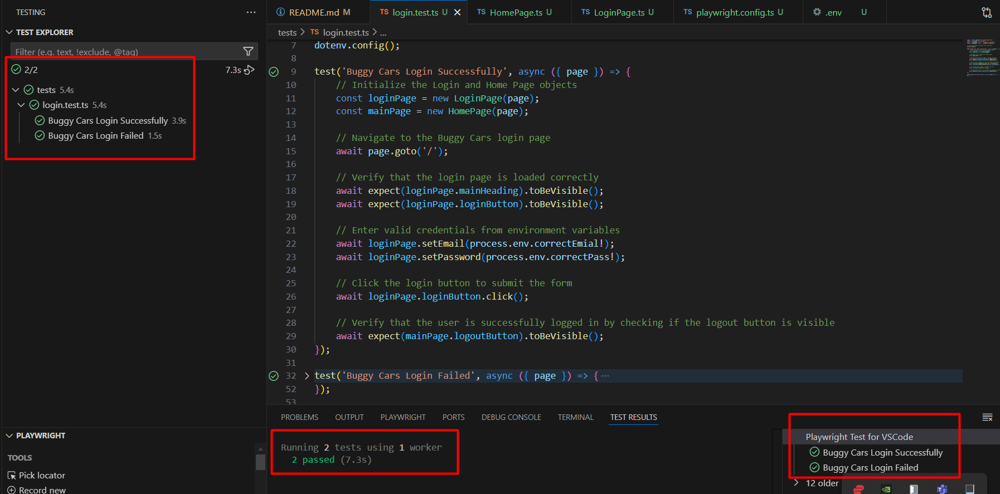

# **BuggyCars_Demo**  
Automated tests for **Buggy Cars Demo** using **Playwright**  

## **Prerequisites**  
Before running the tests, ensure you have the following installed:  
- **Node.js (LTS version recommended)** → [Download Node.js](https://nodejs.org/)  
- **npm (Node Package Manager)** (comes with Node.js)  

## **Setup Instructions**  

### **1. Clone the Repository**  
```sh
git clone <repository-url>
cd BuggyCars_Demo
```

### **2. Install Playwright**  
```sh
npm init playwright@latest
```

### **3. Install Browser Dependencies**  
```sh
npx playwright install --with-deps chromium
```

### **4. Configure Environment Variables**  
Create a **`.env`** file in the root directory and add your credentials:  
```sh
correctEmail=your-email@example.com
correctPass=your-secure-password
incorrectPass=wrong-password
```

### **5. Install dotenv Package**  
```sh
npm install dotenv
```

### **6. Run Tests**  
```sh
npx playwright test
```

### **7. View Test Report**  
```sh
npx playwright show-report
```

## **Additional Notes**  
- **Modify `.env` file** with valid credentials before running the tests.  
- **Tests are configured to run in Chromium** (you can modify `playwright.config.ts` to use other browsers).  
- **To run a specific test**, use:  
  ```sh
  npx playwright test tests/<test-file-name>.test.ts
  ```  
- **For debugging**, run tests in UI mode:  
  ```sh
  npx playwright test --ui
  ```  

## Test Execution Screenshot

Below is an example screenshot captured during test execution:


